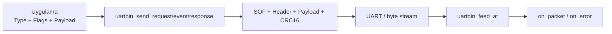
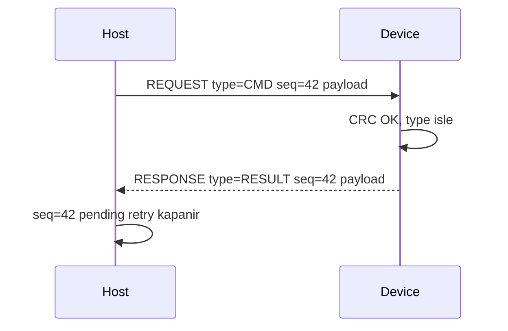
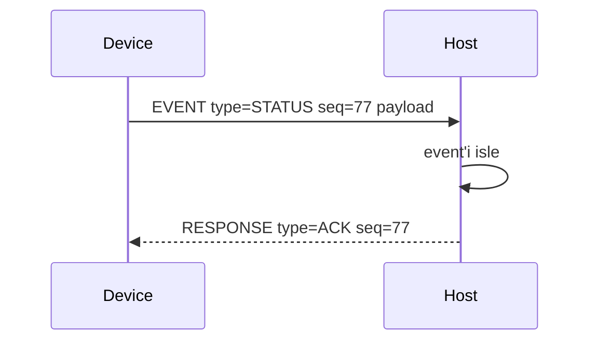
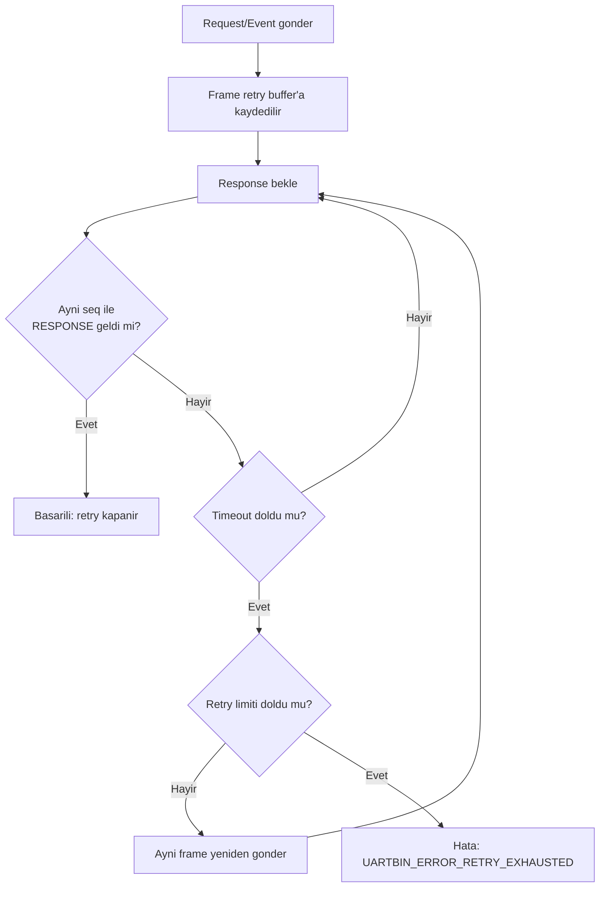

# uartbinlib

`uartbinlib`, UART gibi byte akislari uzerinden cerceveli binary mesaj tasimak
icin kucuk ve platformdan bagimsiz bir C kutuphanesidir. STM32 gibi gomulu
hedefler icin tasarlanmistir, fakat cekirdek kod HAL, RTOS, DMA, interrupt veya
heap bagimliligi tasimaz.

Dokumantasyon: [aackk.github.io/uartbinlib](https://aackk.github.io/uartbinlib/)

## Neden uartbinlib?

Seri hatlarda farkli framing yaklasimlari, PC tarafinda serial port
kutuphaneleri veya gomulu mesajlasma cozumleri kullanilabilir. `uartbinlib`
bunlarin yerine "her seyi kendisi bilen dev bir framework" olmak icin degil,
MCU ile modul arasinda net, kucuk ve guvenilir bir binary haberlesme katmani
vermek icin tasarlanmistir.

One cikan noktalar:

- Bare-metal C: HAL, RTOS, heap veya isletim sistemi bagimliligi yoktur.
- Net cerceve yapisi: SOF, version, type, flags, seq, length, payload ve CRC16.
- Hazir mesaj modeli: request, response ve event akislari icin yardimci API'ler.
- Otomatik sira numarasi: her `uartbin_t` kendi seq counter'ini tasir.
- Opsiyonel guvenilir TX: response gelmezse ayarlanabilir timeout/retry mantigi.
- Iki yonlu kullanim: host MCU, modul, sensor veya gateway gibi rollerde ayni
  cekirdek API kullanilir.
- Port etmesi kolay: sadece `write` hook'u, RX feed cagrisi ve zaman bilgisi
  yeterlidir.

Bu odak sayesinde `uartbinlib`, host ile modul arasindaki komut, cevap ve event
trafigi gibi kucuk ama saglam protokol ihtiyaclarina dogrudan oturur.

## Cerceve Formati

Tum cok byte'li tamsayilar little-endian kodlanir.

| Alan | Boyut | Aciklama |
| --- | ---: | --- |
| SOF | 2 | `0xA5 0x5A` |
| Version | 1 | Protokol surumu, su an `1` |
| Type | 1 | Uygulama tarafindan tanimlanan mesaj tipi |
| Flags | 1 | Uygulama tarafindan tanimlanan bayraklar |
| Ayrilmis | 1 | Su an `0` |
| Sequence | 2 | Uygulama veya otomatik yardimcilar tarafindan kullanilan sira numarasi |
| Payload length | 2 | Payload byte sayisi |
| Payload | N | Kullanici verisi |
| CRC16 | 2 | Header ve payload uzerinden CRC-16/CCITT-FALSE |

## Tasarim

- Dinamik bellek kullanmaz.
- Platform header'i icermez.
- TX icin kullanici tarafindan verilen `write` hook'unu kullanir.
- RX tarafinda tam payload'u kullanici buffer'ina kopyalar.
- `on_packet`, sadece tum cerceve CRC dogrulamasindan gecerse cagrilir.
- Parser hatalari, zaman asimi ve retry hatalari `on_error` ile bildirilir.
- Opsiyonel request/event retry mekanizmasi `uartbin_poll` ile surulur.

## En Kucuk Kullanim

```c
#include "uartbin.h"

static int uart_write(const uint8_t *data, size_t len, void *user)
{
    (void)user;
    /* UART surucun ile tum byte'lari gonder. Basari icin 0 dondur. */
    return 0;
}

static void on_packet(const uartbin_packet_t *packet, void *user)
{
    (void)user;
    /* packet->payload, bir sonraki feed/feed_byte cagrimina kadar gecerlidir. */
}

static void on_error(uartbin_error_t error, void *user)
{
    (void)error;
    (void)user;
}

static uartbin_t link;
static uint8_t rx_payload[4096];

void app_init(void)
{
    uartbin_config_t cfg = {
        .write = uart_write,
        .on_packet = on_packet,
        .on_error = on_error,
        .user = 0,
        .rx_payload_buffer = rx_payload,
        .rx_payload_capacity = sizeof(rx_payload),
        .rx_timeout_ms = 50
    };

    uartbin_init(&link, &cfg);
}

void app_on_uart_rx_byte(uint8_t byte)
{
    uartbin_feed_byte_at(&link, byte, system_millis());
}

void app_send_ping(void)
{
    uint8_t payload[] = { 1, 2, 3 };
    (void)uartbin_send_request(&link, 0x01, 0, payload, sizeof(payload));
}
```

## Otomatik Sira Numaralari

Request/response/event tarzi protokollerde `seq` degerini elle yonetmek yerine
otomatik yardimcilari kullan:

```c
/* Yeni bir konusma baslatir. Link icindeki sira sayaci kullanilir. */
uartbin_send_request(&link, MSG_GET_CONFIG, 0, NULL, 0);

/* Alinan paketi cevaplar. Gelen sira numarasi aynen geri yazilir. */
uartbin_send_response(&link, packet, MSG_CONFIG_VALUE, 0, payload, payload_len);

/* Kendiliginden olusan bir mesaj gonderir. Link icindeki sira sayaci kullanilir. */
uartbin_send_event(&link, MSG_SENSOR_EVENT, 0, payload, payload_len);
```

Her `uartbin_t` kendi sira sayacini tasir. Bu yuzden birden fazla UART linki
birbirinin durumunu etkilemez. Daha ozel durumlarda acik `seq` vermek icin
daha dusuk seviye `uartbin_send()` API'si kullanilabilir.

## Haberlesme Akislari

Temel kullanimda uygulama yalnizca mesaj tipini, flag degerlerini ve payload'u
verir. `uartbinlib` cerceveleme, CRC, otomatik sira numarasi ve opsiyonel retry
durumunu link context'i icinde yonetir.



Request/response akisi ayni `seq` uzerinden eslesir. Response tarafinda gelen
paketin sira numarasi otomatik olarak geri yazilir.



Event akisi kendiliginden olusan durumlar icin kullanilir. Istenirse event de
ACK/response ile guvenilir hale getirilebilir.



## Otomatik Retry

Otomatik retry opsiyoneldir. Her link icin statik bir TX retry buffer'i ve retry
ayarlari vererek etkinlestirilir:

```c
static uint8_t rx_payload[256];
static uint8_t tx_retry_frame[UARTBIN_MAX_FRAME_OVERHEAD + 256];

uartbin_config_t cfg = {
    .write = uart_write,
    .on_packet = on_packet,
    .on_error = on_error,
    .rx_payload_buffer = rx_payload,
    .rx_payload_capacity = sizeof(rx_payload),
    .rx_timeout_ms = 50,
    .tx_retry_buffer = tx_retry_frame,
    .tx_retry_capacity = sizeof(tx_retry_frame),
    .tx_retry_timeout_ms = UARTBIN_DEFAULT_RETRY_TIMEOUT_MS,
    .tx_retry_max_retries = UARTBIN_DEFAULT_RETRY_MAX_RETRIES
};
```

Retry acikken `uartbin_send_request()` ve `uartbin_send_event()` kodlanmis
cerceveyi retry buffer'ina kaydeder. `uartbin_poll(&link, now_ms)` periyodik
olarak cagrilmalidir. Ayni `seq` degerini tasiyan ve `UARTBIN_FLAG_RESPONSE`
bayragi olan cevap zaman asimi suresi icinde gelmezse cerceve yeniden gonderilir.
Retry limiti dolarsa `on_error`, `UARTBIN_ERROR_RETRY_EXHAUSTED` alir.

Retry katmani her `uartbin_t` icin ayni anda bir pending reliable request/event
tutar. Ilk cevap gelmeden ikinci reliable request/event gonderilirse
`UARTBIN_EBUSY` doner. Uygulama pending istegi bilincli olarak iptal etmek
isterse `uartbin_cancel_retry()` kullanabilir.

Cift yonlu protokollerde iki cihaz da ayni kalibi kullanir:

```c
/* Gonderen taraf guvenilir bir is baslatir. */
uartbin_send_request(&link, MSG_DEVICE_COMMAND, 0, payload, payload_len);

/* Alan taraf dogrulama veya islemi bitirdikten sonra cevap verir. */
uartbin_send_response(&link, packet, MSG_DEVICE_RESULT, 0, result, result_len);

/* Iki taraf da event yayinlayip ACK tarzi cevap bekleyebilir. */
uartbin_send_event(&link, MSG_DEVICE_EVENT, 0, event, event_len);
uartbin_send_response(&link, packet, MSG_ACK, 0, NULL, 0);
```

Retry akisi `uartbin_poll()` ile surulur. Timeout dolarsa ayni frame yeniden
gonderilir; eslesen response gelirse pending durum kapanir.



## STM32 Entegrasyon Ozeti

STM32'ye ozel kod kutuphane cekirdeginin disinda tutulur. RX byte'larini
interrupt, DMA idle callback veya task dongusunden `uartbin_feed_at` /
`uartbin_feed_byte_at` ile besle.

`write` hook'u, donmeden once tum byte'lari gondermis veya TX kuyruguna
kopyalamis olmalidir; cunku `uartbin_send` SOF, header, payload ve CRC icin
birden fazla write cagrisi yapabilir. Ornekler sadelik ve dogruluk icin
blocking `HAL_UART_Transmit` kullanir. Non-blocking TX gerekiyorsa uygulama
adapter'inda TX queue kullan.

Bak:

- `examples/stm32_hal_interrupt.c`
- `examples/stm32_hal_dma_idle.c`

## Linux POSIX Serial Ozeti

Linux uzerinde STM32 HAL yerine POSIX serial port kullanilir. `termios` ile port
raw 8N1 moda alinir, RX icin `poll(POLLIN)` ve `read()`, TX icin `write()` veya
uygulama kuyrugu kullanilir.

Bak:

- `examples/linux_posix_serial.c`
- Doxygen icinde Linux POSIX Serial Kullanimi

## Buyuk Payloadlar

Daha buyuk paketler icin daha buyuk statik RX payload buffer'i ayir. Bu API'yi
basit tutar ve uygulamanin veriyi sadece CRC basarili olduktan sonra gormesini
saglar.

```c
static uint8_t rx_payload[4096];
```

Gelen cerceve `rx_payload_capacity` degerinden buyuk payload ilan ederse parser
paketi `UARTBIN_ERROR_BAD_LENGTH` ile reddeder ve yeniden senkron aramaya doner.

## Zaman Asimi

`rx_timeout_ms` ayarla ve `uartbin_poll(&link, now_ms)` fonksiyonunu periyodik
cagir. `_at` feed fonksiyonlari da her byte/block kabul etmeden once RX zaman asimi
kontrolu yapar:

```c
uartbin_feed_at(&link, dma_data, dma_len, HAL_GetTick());
uartbin_poll(&link, HAL_GetTick());
```

STM32 HAL UART hatalarinda parser'i resetle, RX yolunu abort/restart et ve hata
sayaci tut. Ornek adapter'lar bu kalibi gosterir.

## Derleme

```sh
cmake -S . -B build
cmake --build build
ctest --test-dir build
```

Visual Studio gibi multi-config generator'larda CTest'e config ver:

```sh
ctest --test-dir build -C Debug
```

## Dokumantasyon

HTML dokumantasyonu Doxygen ile uret:

```sh
doxygen Doxyfile
```

Tarayicida `docs/html/index.html` dosyasini ac.

Ek Doxygen rehber sayfalari:

- API Kullanim Rehberi
- Port Etme Rehberi
- Halka Buffer TX Portu
- STM32 Interrupt ve DMA Kullanimi
- Linux POSIX Serial Kullanimi
