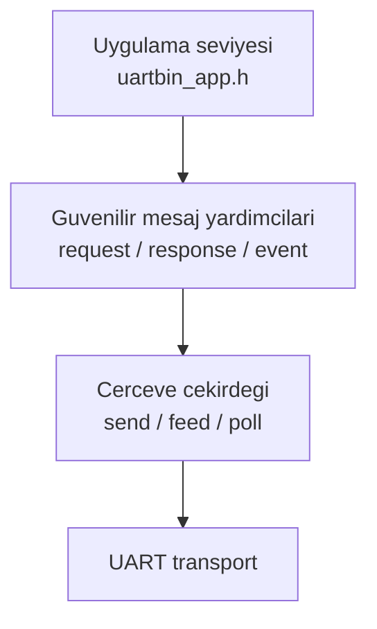
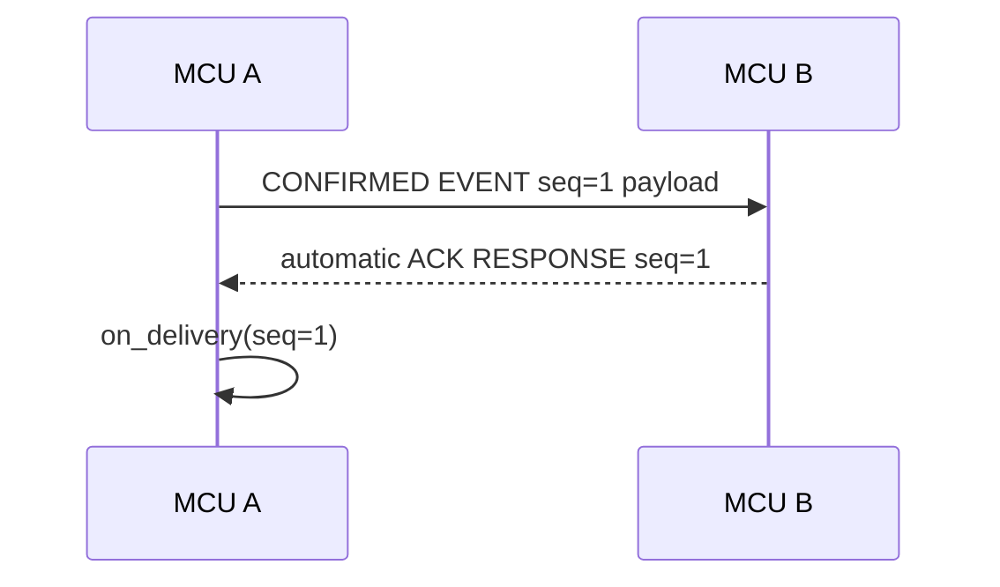
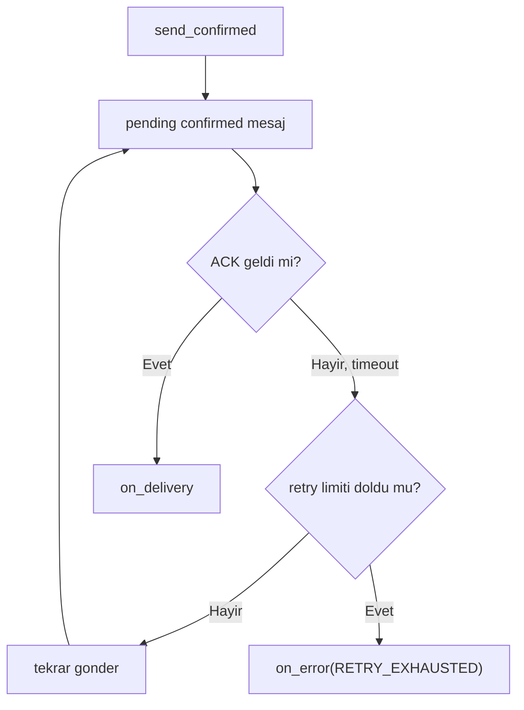

\page guide_api_usage API Kullanim Rehberi

# API Kullanim Rehberi

uartbinlib iki katmandan olusur:

- Cerceve katmani: `uartbin_send()`, `uartbin_feed_at()`, `uartbin_poll()`.
- Guvenilir mesaj katmani: `uartbin_send_request()`,
  `uartbin_send_response()`, `uartbin_send_event()`.
- App mesaj katmani: `uartbin_app_send_confirmed()`,
  `uartbin_app_feed_at()`, `uartbin_app_poll()`.

Cogu uygulama, ACK/seq/retry ayrintisini saklayan app katmanini kullanabilir.
Alt seviye request/response/event API'leri ozel protokol akislarinda hala
dogrudan kullanilabilir.

## Kritik Kural: Ayni Linkte API Ailelerini Karistirma

> **UYARI:** Bir fiziksel UART linki icin tek runtime API ailesi sec. App
> katmani kullaniyorsan ayni linki cekirdek `uartbin_*` feed/poll/init
> fonksiyonlariyla tekrar servis etme.

| Ne yapmak istiyorsun? | Kullanilacak API | Kullanilmayacak API |
| --- | --- | --- |
| Frame, CRC, seq ve request/response/event seviyesinde calismak | `uartbin_init()`, `uartbin_feed_at()`, `uartbin_feed_byte_at()`, `uartbin_poll()`, `uartbin_send_request()`, `uartbin_send_response()`, `uartbin_send_event()` | `uartbin_app_init()`, `uartbin_app_feed_at()`, `uartbin_app_poll()` |
| Uygulama seviyesinde confirmed mesaj, otomatik ACK ve retry kullanmak | `uartbin_app_init()`, `uartbin_app_feed_at()`, `uartbin_app_feed_byte_at()`, `uartbin_app_poll()`, `uartbin_app_send_confirmed()`, `uartbin_app_send()` | Ayni link icin `uartbin_init()`, `uartbin_feed_at()`, `uartbin_feed_byte_at()`, `uartbin_poll()` |

`uartbin_app_t` icinde bir cekirdek `uartbin_t` bulunur. Bu nedenle
`uartbin_app_feed_at()` zaten altta `uartbin_feed_at()` yolunu,
`uartbin_app_poll()` ise altta `uartbin_poll()` yolunu servis eder. Ayni RX
verisini iki API ailesine birden vermek parser'i ayni byte'larla iki kez
beslemek anlamina gelir.



## App Katmani: Otomatik Confirmed Mesaj

Bu katmanda uygulama sadece payload'u API'ye verir. Peer da app katmani
kullaniyorsa confirmed mesaj alindiginda ACK otomatik gonderilir. ACK gelmezse
`uartbin_app_poll()` ayni frame'i retry timeout'a gore tekrar gonderir.
Duplicate retry frame'i gelirse ACK yeniden gonderilir fakat mesaj uygulamaya
ikinci kez teslim edilmez.

```c
#include "uartbin_app.h"

static uartbin_app_t app;
static uint8_t rx_payload[256];
static uint8_t tx_retry_frame[UARTBIN_MAX_FRAME_OVERHEAD + 256];

static void on_message(const uartbin_app_message_t *message, void *user)
{
    (void)user;
    /* Burada yalnizca gercek uygulama mesajlari gorulur, ACK paketleri gorulmez. */
}

static void on_delivery(uint16_t seq, void *user)
{
    (void)seq;
    (void)user;
    /* Gonderdigimiz confirmed mesaj peer tarafindan ACK'lendi. */
}

void protocol_init(void)
{
    uartbin_app_config_t cfg = {
        .write = uart_write,
        .on_message = on_message,
        .on_delivery = on_delivery,
        .on_error = on_error,
        .user = NULL,
        .rx_payload_buffer = rx_payload,
        .rx_payload_capacity = sizeof(rx_payload),
        .rx_timeout_ms = 50,
        .tx_retry_buffer = tx_retry_frame,
        .tx_retry_capacity = sizeof(tx_retry_frame),
        .tx_retry_timeout_ms = UARTBIN_DEFAULT_RETRY_TIMEOUT_MS,
        .tx_retry_max_retries = UARTBIN_DEFAULT_RETRY_MAX_RETRIES
    };

    uartbin_app_init(&app, &cfg);
}

void send_payload(const uint8_t *payload, uint16_t payload_len)
{
    (void)uartbin_app_send_confirmed(&app, MSG_DATA, 0, payload, payload_len);
}

void on_uart_rx(const uint8_t *data, size_t len)
{
    uartbin_app_feed_at(&app, data, len, platform_millis());
}

void loop_tick(void)
{
    uartbin_app_poll(&app, platform_millis());
}
```

`uartbin_app_send()` ayni app mesaj modelini ACK beklemeden kullanir.
`uartbin_app_t` initialize edildikten sonra kopyalanmamalidir; her link icin
kalici bir static/global veya sahipligi net bir context kullan.

App katmani kullanildiginda ayni link icin yalnizca `uartbin_app_poll()` cagir.
`uartbin_app_poll()` zaten kendi icindeki `uartbin_t` icin `uartbin_poll()`
cagirir; ayrica `uartbin_poll(&app.link, now_ms)` cagrisi yapma.
Ayni sekilde RX tarafinda `uartbin_app_feed_at()` kullaniyorsan ayni veri icin
`uartbin_feed_at(&app.link, ...)` cagrisi yapma.



ACK gelmezse hata send fonksiyonundan gecikmeli olarak donmez. Retry zamanlamasi
`uartbin_app_poll()` icinde calisir; basarisiz sonuc `on_error()` callback'i ile
bildirilir.



Daha ayrintili seq, duplicate ve cift yonlu feedback akislari icin
`Confirmed App Katmani` rehberine bak.

## Temel Kurulum

Her UART linki icin bir `uartbin_t` ayir. Her link kendi RX parser durumunu,
otomatik TX sira sayacini ve opsiyonel retry durumunu tasir.

```c
static uartbin_t link;
static uint8_t rx_payload[256];
static uint8_t tx_retry_frame[UARTBIN_MAX_FRAME_OVERHEAD + 256];

static int uart_write(const uint8_t *data, size_t len, void *user)
{
    /* Tum byte'lari simdi gonder veya bir TX kuyruguna kopyala. */
    return platform_uart_write(data, len, user) == 0 ? 0 : -1;
}

static void on_packet(const uartbin_packet_t *packet, void *user)
{
    (void)user;

    switch (packet->type) {
    case MSG_DEVICE_COMMAND:
        /* Dogrula/isle ve ayni sira numarasi ile cevapla. */
        uartbin_send_response(&link, packet, MSG_DEVICE_RESULT, 0, NULL, 0);
        break;

    case MSG_DEVICE_EVENT:
        /* Peer tarafindan event geldi; ACK ile cevapla. */
        uartbin_send_response(&link, packet, MSG_ACK, 0, NULL, 0);
        break;

    default:
        uartbin_send_response(&link, packet, MSG_NACK, 0, NULL, 0);
        break;
    }
}

static void on_error(uartbin_error_t error, void *user)
{
    (void)user;
    /* Say, logla, supervisor'a bildir veya ust seviye session'i resetle. */
}

void protocol_init(void)
{
    uartbin_config_t cfg = {
        .write = uart_write,
        .on_packet = on_packet,
        .on_error = on_error,
        .user = NULL,
        .rx_payload_buffer = rx_payload,
        .rx_payload_capacity = sizeof(rx_payload),
        .rx_timeout_ms = 50,
        .tx_retry_buffer = tx_retry_frame,
        .tx_retry_capacity = sizeof(tx_retry_frame),
        .tx_retry_timeout_ms = UARTBIN_DEFAULT_RETRY_TIMEOUT_MS,
        .tx_retry_max_retries = UARTBIN_DEFAULT_RETRY_MAX_RETRIES
    };

    uartbin_init(&link, &cfg);
}
```

## Mesaj Gonderme

Bu cihaz peer'dan bir is istiyorsa request kullan:

```c
uartbin_send_request(&link, MSG_SET_OUTPUT, 0, payload, payload_len);
```

Alinan paketi cevaplarken response kullan:

```c
uartbin_send_response(&link, packet, MSG_DEVICE_RESULT, 0, result, result_len);
```

Modulun kendiliginden olusan bir durumu raporlamasi gibi veriler icin event
kullan:

```c
uartbin_send_event(&link, MSG_DEVICE_EVENT, 0, event, event_len);
```

## Byte Alma

Alinan her byte'i veya blogu monotonic milisaniye timestamp ile parser'a besle:

```c
uartbin_feed_at(&link, rx_data, rx_len, platform_millis());
```

`uartbin_poll()` fonksiyonunu main loop, scheduler tick veya RTOS task icinden
periyodik cagir. Bu fonksiyon RX parser timeout ve TX retry zamanlamasini
yonetir:

```c
uartbin_poll(&link, platform_millis());
```

Feed fonksiyonlari byte kabul etmeden once yalnizca RX parser timeout kontrolu
yapar. Pending reliable mesajlari yeniden gondermez. TX retry yazmalarinin UART
RX interrupt veya DMA callback icinde beklenmedik sekilde calismamasi icin
retry yolunu acik `uartbin_poll()` cagrinda tut.

## Guvenilir Mesaj Kurallari

Retry acikken:

- `uartbin_send_request()` ve `uartbin_send_event()` kodlanmis cerceveyi saklar.
- Ayni `seq` degerine sahip `UARTBIN_FLAG_RESPONSE` gelmezse cerceve
  `uartbin_poll()` tarafindan yeniden gonderilir.
- Retry sayisi biterse `on_error`, `UARTBIN_ERROR_RETRY_EXHAUSTED` alir.
- Her `uartbin_t` icin ayni anda yalnizca bir reliable request/event pending
  olabilir; baska bir gonderim `UARTBIN_EBUSY` dondurur.

Peer, reliable request/event paketlerine `uartbin_send_response()` ile cevap
vermelidir. Bu fonksiyon gelen sira numarasini otomatik olarak geri yazar.

## Packet Omru

`packet->payload`, ayarlanan RX payload buffer'ini isaret eder. Ayni context
uzerinde bir sonraki feed, poll, reset veya parser islemine kadar gecerlidir.
Daha uzun sure saklanacaksa payload'u `on_packet()` icinde kopyala.
