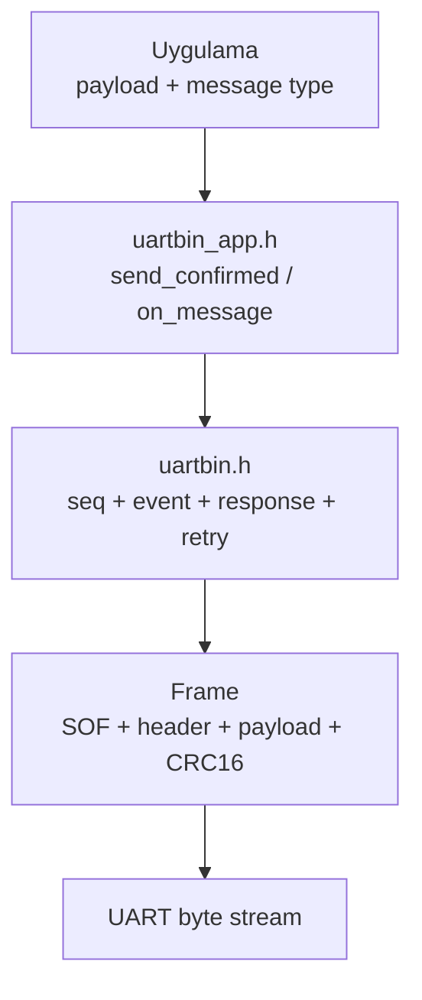
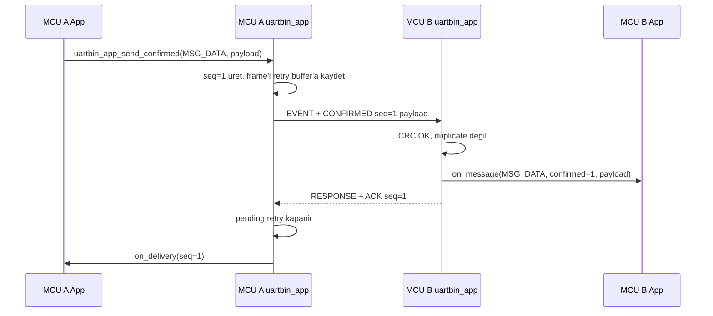
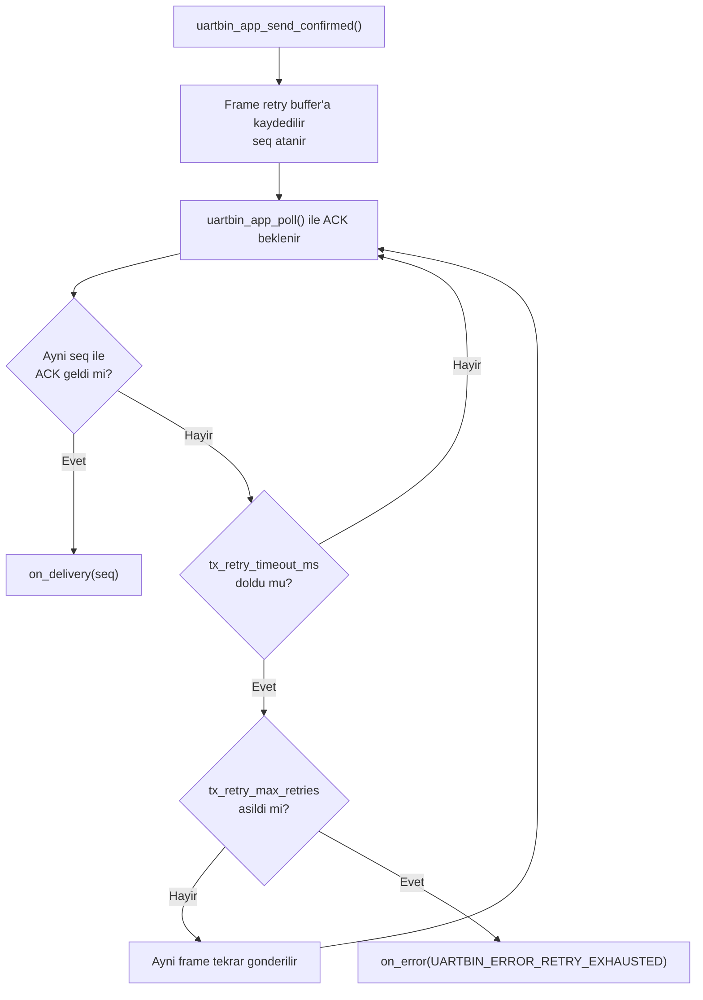
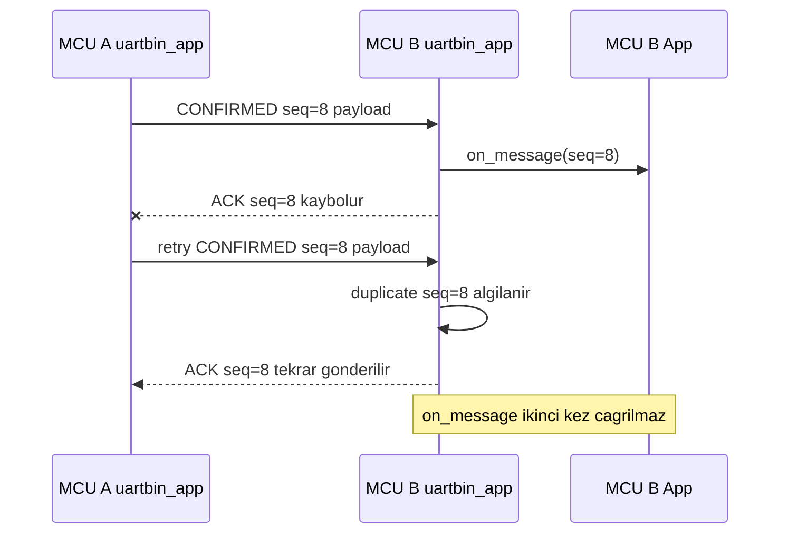
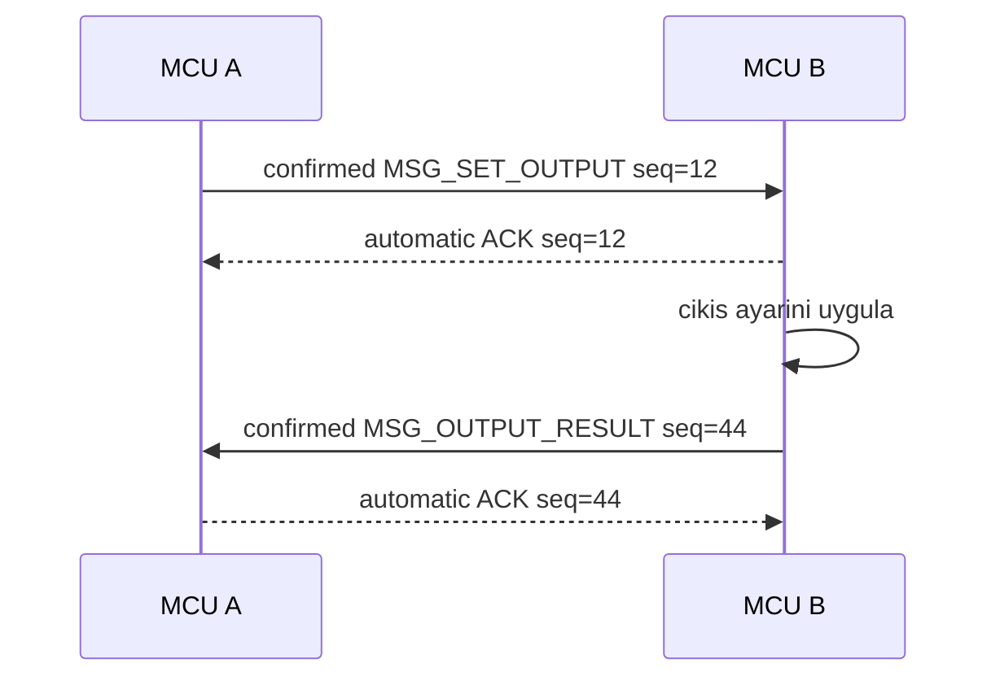

\page guide_confirmed_app Confirmed App Katmani

# Confirmed App Katmani

`uartbin_app.h`, cekirdek `uartbin.h` API'sinin ustunde duran uygulama seviyesi
mesaj katmanidir. Amaci, iki cihaz arasinda payload gonderirken uygulama kodunu
ACK, seq, response ve retry ayrintilarindan ayirmaktir.

Bu katmanda iki temel gonderim vardir:

- `uartbin_app_send_confirmed()`: ACK bekleyen, otomatik retry yapan mesaj.
- `uartbin_app_send()`: ACK beklemeyen normal uygulama mesaji.

Confirmed mesajlarda alici taraf ACK'i otomatik gonderir. Gonderen taraf ACK
alamazsa `uartbin_app_poll()` icinde ayni frame'i retry eder. Retry limiti
dolarsa uygulama `on_error(UARTBIN_ERROR_RETRY_EXHAUSTED, user)` callback'i ile
haberdar edilir.

## Katman Mimarisi

App katmani yeni bir cerceve formati icat etmez. Altta ayni `uartbin` frame,
CRC, seq ve response/retry mekanizmasi kullanilir.



`uartbin_app_t`, icinde bir `uartbin_t` tasir. Bu nedenle her UART linki icin
ayri bir `uartbin_app_t` ayirmak gerekir. Context initialize edildikten sonra
kopyalanmamalidir.

## App Katmani Secildiginde Ne Kullanilir?

> **UYARI:** App katmani kullanilan bir linkte disaridan sadece
> `uartbin_app_*` runtime fonksiyonlarini cagir. Ayni link icin cekirdek
> `uartbin_init()`, `uartbin_feed_at()` veya `uartbin_poll()` cagrilarini
> ayrica yapma.

App katmani bir "ikinci engine" degildir; alttaki cekirdek engine'i kendi
icinde kullanan ust seviye API'dir. Bu yuzden app kullanan bir portta normal
akis soyledir:

| Adim | Cagir |
| --- | --- |
| Init | `uartbin_app_init(&app, &cfg)` |
| RX byte/block besleme | `uartbin_app_feed_byte_at(&app, byte, now_ms)` veya `uartbin_app_feed_at(&app, data, len, now_ms)` |
| Periyodik servis | `uartbin_app_poll(&app, now_ms)` |
| Confirmed mesaj | `uartbin_app_send_confirmed(&app, type, flags, payload, len)` |
| Unconfirmed mesaj | `uartbin_app_send(&app, type, flags, payload, len)` |

Bu link icin normal port kodunda sunlari cagirma:

```c
uartbin_init(&app.link, ...);              /* Yanlis: app init zaten kurar. */
uartbin_feed_at(&app.link, data, len, now);/* Yanlis: app feed zaten besler. */
uartbin_poll(&app.link, now);              /* Yanlis: app poll zaten cagirir. */
```

Ayni RX verisini hem app feed'e hem core feed'e vermek frame parser'i ayni
byte'larla iki kez besler. Bu, CRC/seq/ACK/retry davranisini bozabilir.

## Basarili Confirmed Mesaj Akisi

MCU A confirmed mesaj gonderdiginde seq degeri otomatik uretilir. MCU B mesaj
CRC dogrulamasindan gecince uygulamaya teslim eder ve ayni seq ile ACK response
gonderir. MCU A bu ACK'i gorunce pending retry durumunu kapatir ve
`on_delivery(seq, user)` callback'ini cagirir.



## ACK Kaybi ve Retry Akisi

ACK gelmezse `uartbin_app_send_confirmed()` sonradan yeni bir return degeri
uretemez; cunku retry asenkron olarak `uartbin_app_poll()` ile calisir. Ilk
gonderimin baslayip baslamadigi send fonksiyonunun return degeridir. Sonraki
teslim veya hata sonucu callback'lerle bildirilir.



## Duplicate Mesaj Davranisi

MCU B mesaji almis ve ACK gondermis olabilir, fakat ACK yolda kaybolabilir. Bu
durumda MCU A ayni seq ile ayni frame'i tekrar yollar. MCU B app katmani bunu
duplicate olarak algilar:

- ACK'i tekrar gonderir.
- Mesaji `on_message()` callback'ine ikinci kez teslim etmez.



## Feedback ve Cift Yonlu Mesajlasma

Otomatik ACK yalnizca transport seviyesinde "mesaj alindi" bilgisidir. MCU B
isterse gelen mesaji isledikten sonra kendi uygulama cevabini yeni bir mesaj
olarak gonderebilir. Bu cevap confirmed veya unconfirmed olabilir.



Bagimsiz event'ler de ayni anda iki yonde kullanilabilir. Her cihaz kendi
`uartbin_app_t` context'inde kendi TX seq sayacini ve pending confirmed durumunu
tutar.

## API Ozeti

```c
#include "uartbin_app.h"

static uartbin_app_t app;
static uint8_t rx_payload[256];
static uint8_t tx_retry_frame[UARTBIN_MAX_FRAME_OVERHEAD + 256];

static void on_message(const uartbin_app_message_t *message, void *user)
{
    (void)user;
    /* ACK paketleri burada gorulmez. */
}

static void on_delivery(uint16_t seq, void *user)
{
    (void)seq;
    (void)user;
    /* Confirmed mesaj ACK aldi. */
}

static void on_error(uartbin_error_t error, void *user)
{
    (void)user;
    /* Retry exhausted, parser timeout, CRC hatasi vb. */
}

void protocol_init(void)
{
    uartbin_app_config_t cfg = {
        .write = uart_write,
        .on_message = on_message,
        .on_delivery = on_delivery,
        .on_error = on_error,
        .user = NULL,
        .rx_payload_buffer = rx_payload,
        .rx_payload_capacity = sizeof(rx_payload),
        .rx_timeout_ms = 50,
        .tx_retry_buffer = tx_retry_frame,
        .tx_retry_capacity = sizeof(tx_retry_frame),
        .tx_retry_timeout_ms = UARTBIN_DEFAULT_RETRY_TIMEOUT_MS,
        .tx_retry_max_retries = UARTBIN_DEFAULT_RETRY_MAX_RETRIES
    };

    uartbin_app_init(&app, &cfg);
}
```

Main loop veya scheduler icinde RX feed ve poll birlikte kullanilir:

```c
void uart_rx_callback(const uint8_t *data, size_t len)
{
    uartbin_app_feed_at(&app, data, len, platform_millis());
}

void main_loop_tick(void)
{
    uartbin_app_poll(&app, platform_millis());
}
```

App katmani kullanirken ayni fiziksel link icin ikinci bir poll cagrisi yapma.
`uartbin_app_poll()` alttaki `app.link` icin `uartbin_poll()` cagrimini zaten
yapar. Yani `uartbin_app_poll(&app, now_ms)` ile birlikte
`uartbin_poll(&app.link, now_ms)` cagirmak gerekmez.
Ayni kural feed icin de gecerlidir: `uartbin_app_feed_at()` kullanilan linkte
ayni RX byte'larini `uartbin_feed_at()` ile tekrar besleme.

Mesaj gonderimi:

```c
/* ACK bekleyen mesaj. */
(void)uartbin_app_send_confirmed(&app, MSG_DATA, 0, payload, payload_len);

/* ACK beklemeyen mesaj. */
(void)uartbin_app_send(&app, MSG_LOG, 0, payload, payload_len);
```

## Callback ve Return Kurallari

- `uartbin_app_send_confirmed()` yalnizca ilk gonderimin baslayip baslamadigini
  return eder.
- ACK alinirsa `on_delivery(seq, user)` cagrilir.
- ACK hic gelmez ve retry limiti dolarsa `on_error(UARTBIN_ERROR_RETRY_EXHAUSTED, user)`
  cagrilir.
- Gelen confirmed mesajlar icin ACK otomatik doner.
- ACK response paketleri `on_message()` callback'ine teslim edilmez.
- Duplicate confirmed frame tekrar ACK'lenir fakat uygulamaya yeniden verilmez.

## Ornekler

App katmanini platform adapter'lariyla birlikte gosteren iki ornek vardir:

- `examples/stm32_app_confirmed.c`: STM32 HAL interrupt RX ile
  `uartbin_app_send_confirmed()` kullanimi.
- `examples/linux_app_confirmed.c`: Linux POSIX serial, `poll()` dongusu ve
  confirmed mesaj callback'leri.
